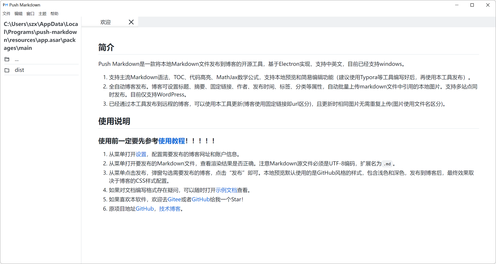
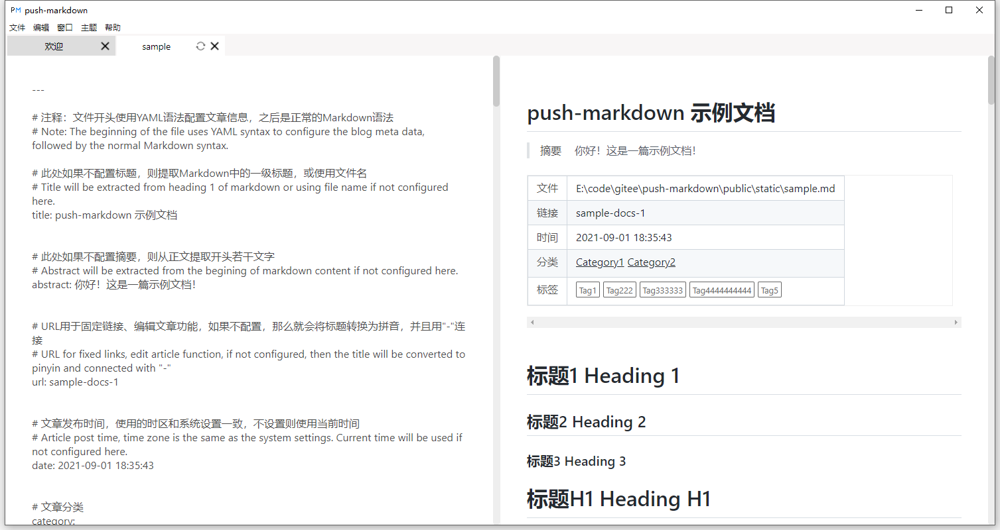
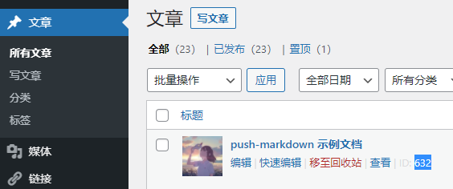
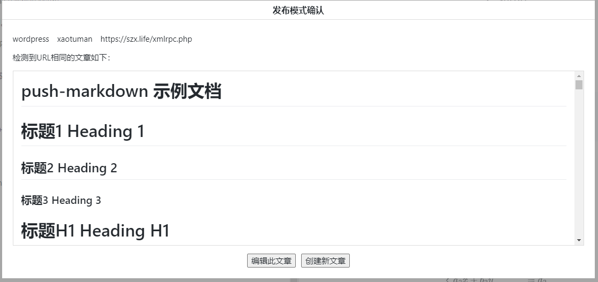
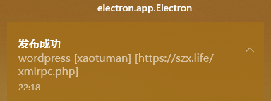

# 使用教程

## 下载安装

从[下载地址](https://gitee.com/xaotuman/push-markdown/releases)下载最新版本的软件，然后进行安装。

## WordPress源码修改

**重要提示**：要使用软件，需要对WordPress源码进行一定的修改，为了能够成功上传图片和覆盖图片。

### 脚本替换

运行[change.sh](docs/change.sh)脚本，需要放在wordpress根目录下，或者自己改一下里面的path路径，然后给与执行权限，运行一下就行。

### 手动替换

#### base64编码

参考网址：https://www.znian.cn/823.html

图片上传默认编码发现不行，不知道为什么，原来的工具是可以支持的，明明代码都是一样的，所以需要改一下。xmlrpc将媒体文件的解码方式改为base64。

文件路径在wp-includes/class-wp-xmlrpc-server.php，因此需要

找到 mw_newMediaObject函数下面的语句

```php
$bits = $data['bits'];
```

改成下面这条语句

```php
$bits = base64_decode($data['bits']);
```

#### 上传媒体覆盖

并在后面加入这一条语句，作用是为了xmlrpc上传媒体文件时覆盖文件，而不是创建新的文件（别不改变原来前台界面上传媒体文件的逻辑，仅为xmlrpc方式）。

可以参考[网址](https://gist.github.com/koke/5720862#file-xmlrpc-test-upload-php)，或者参考我拷贝的[本地文件](docs/class-wp-xmlrpc-server.php)，在版本5.8的基础上进行的修改。

```php
if ( !empty($data['overwrite']) && ($data['overwrite'] == true) ) {
    // Get postmeta info on the object.
    $old_file = $wpdb->get_row("
		SELECT ID
    	FROM {$wpdb->posts}
		WHERE post_title = '{$name}'
		AND post_type = 'attachment'
		");

    // Delete previous file.
    wp_delete_attachment($old_file->ID);

    // Make sure the new name is different by pre-pending the
    // previous post id.
    //$filename = preg_replace('/^wpid\d+-/', '', $name);
    //$name = "wpid{$old_file->ID}-{$filename}";
}
```

## MathJax使用（可选）

不是所有人都需要MathJax，所以这步操作可以跳过，其实也就是美化一下css，让公式能够居中显示并且一行一公式。

配置WordPress的外观-自定义-额外CSS，加入下面这行代码。

```css
mjx-container[jax="SVG"][display="true"] {
    display: block;
    text-align: center;
    margin: 1em 0;
}
```


## 开始使用

### 欢迎界面

打开软件，就是欢迎界面，非常清新脱俗啊！



### 示例文档

详细的语法规则可以查看工具中的示例文档，点击欢迎界面的示例文档进行查看，或者点击菜单栏-帮助-查看示例文档，或是查看仓库内的[示例文档](https://gitee.com/xaotuman/push-markdown/blob/master/docs/sample.md)。

文件开头使用YAML语法格式定义文章的信息，重点要注意的是**建议给文章配置url参数**，编辑已发布文章时根据这个参数区分不同的文章。文章分类的需要提前在wordpress创建好，如果没有创建好，那么则会被自动分类到未分类的类别里面。

```yaml
---
# 注释：文件开头使用YAML语法配置文章信息，之后是正常的Markdown语法
# Note: The beginning of the file uses YAML syntax to configure the blog meta data, followed by the normal Markdown syntax.

# 此处如果不配置标题，则提取Markdown中的一级标题，或使用文件名
# Title will be extracted from heading 1 of markdown or using file name if not configured here.
title: push-markdown 示例文档


# 此处如果不配置摘要，则从正文提取开头若干文字
# Abstract will be extracted from the begining of markdown content if not configured here.
abstract: 你好！这是一篇示例文档！


# URL用于固定链接、编辑文章功能，建议所有文章都配置
# URL is used for permalink and article editing, and it is recommended to be configured.
url: sample-docs-1


# 文章发布时间，使用的时区和系统设置一致，不设置则使用当前时间
# Article post time, time zone is the same as the system settings. Current time will be used if not configured here.
date: 2021-09-01 18:35:43


# 文章分类
category:
- Category1
- Category2


# 文章标签
tags:
- Tag1
- Tag222
- Tag333333
- Tag4444444444
- Tag5


---

# 标题1 Heading 1

## 标题2 Heading 2

### 标题3 Heading 3

标题H1 Heading H1
====

标题H2 Heading H2
------


## 目录 Table
```



### 设置

可以点击欢迎界面的设置进行站点的设置，或者点击菜单栏-文件-设置。

分为以下两部分，博客站点设置和渲染设置。

博客站点设置需要填写名称，URL，用户名和密码，填完自动保存。

渲染设置建议默认就行了，其他设置可能会无效。


### 发布

当填写完设置界面后，就可以发布。


发布一共有三种模式。

自动模式、手动模式和创建新文章。

1、创建新文章

这个最好理解了，创建一篇新的文章，即使在wordpress已经有了，也会创建一篇新的。此时图片会上传到Wordpress，并且在本地会有缓存。

推荐发布新文章的时候使用。

2、自动判断

自动判断会从本地获取之前已经发布过的文章（依据相同的url），如果获取不到的话，那么就会去获取远程的文章ID（这里是根据相同的标题），由于是获取所有的文章，并且包括内容，所以会比较费时费流量，如果都没有获取到的话，那就会创建新的文章。

推荐之前本机已经发布过新文章，并且覆盖旧文章的时候使用。

3、手动模式

手动模式在自动判断的基础上，又加了一层，可以输入指定的文章ID来强制覆盖旧文章。


文章ID在wordpress后台的文章找到ID。



如果文章ID为0的话，那么就变成和自动判断一个逻辑，只不过需要多一步操作，会弹出是编辑此文章还是创建新文章，那么选择其中一个就行了。



图片的逻辑如下：

​	如果在手动模式下，选择了强制更新图片，那么就会强制覆盖原来有的图片，而且不会生成新的图片。自动覆盖的代码也需要修改wordpress的部分代码，因为wordpress的xmlrpc原本的逻辑是会生成-1,-2这样后缀的图片，而不会覆盖原来的图片，所以需要加一小段。

​	如果在手动模式下的不强制更新图片或者自动模式，那么就会检查本地缓存和远程URL有没有图片记录，如果都有，那么就不会更新图片，即便图片已经经过了修改（只看文件名称）。如果没有，那么也会进行覆盖更新。

​	因此我的建议是，在远程删除了图片，或者本地修改了图片，那么就强制更新图片，自动模式不一定有效，因为有时候还有CDN的效果，即使删除了图片，CDN还有缓存，会有影响。

### 完成

发布完成后，windows会有消息弹出，表示发布成功了，这时候你就可以去WordPress查看文章啦！

