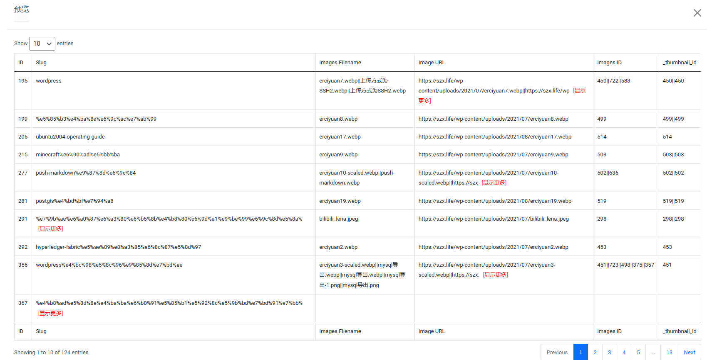
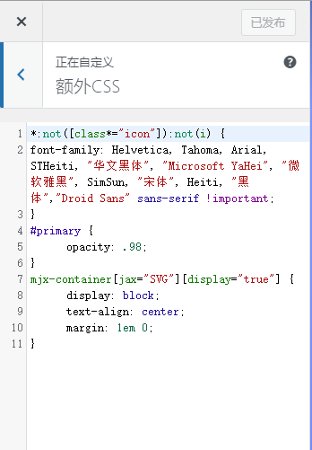
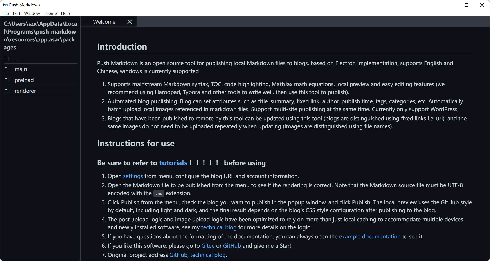
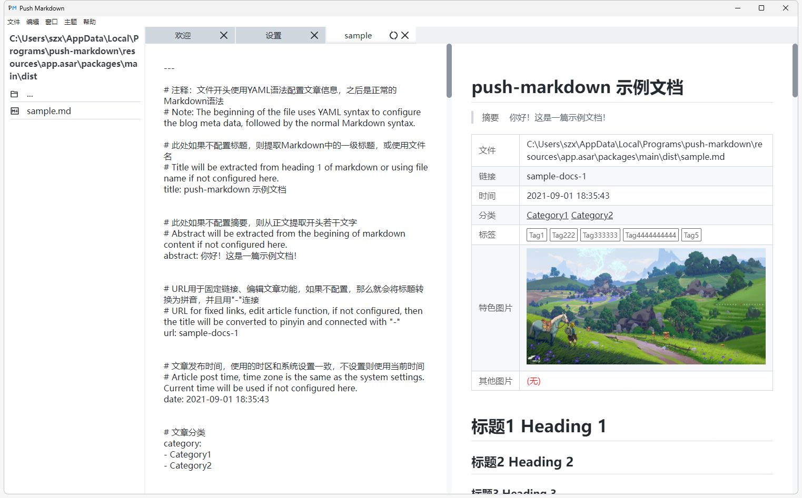
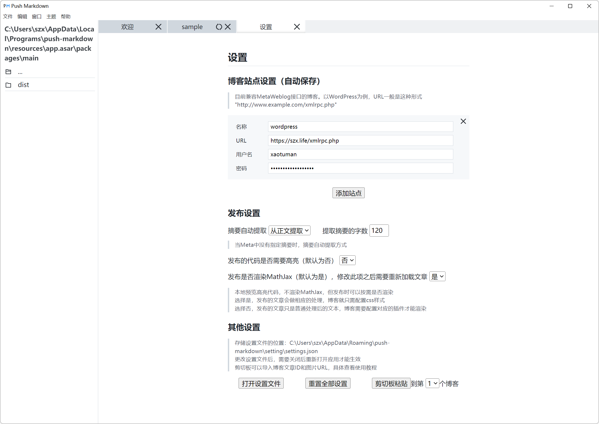
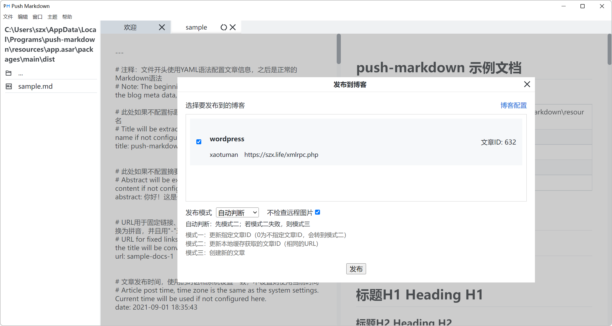
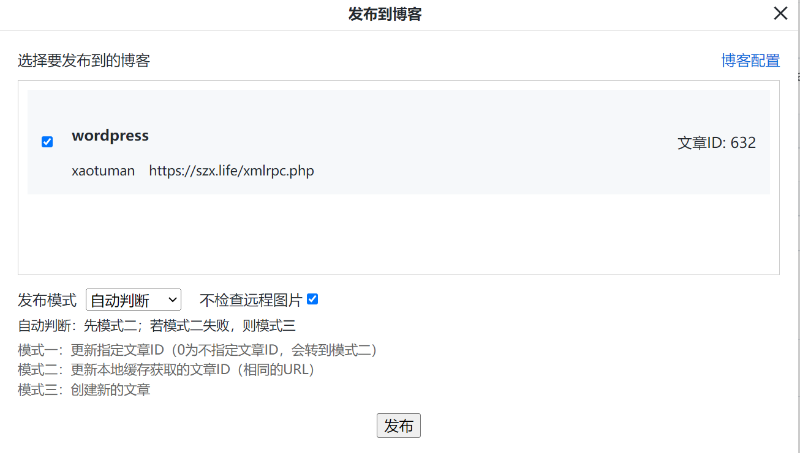
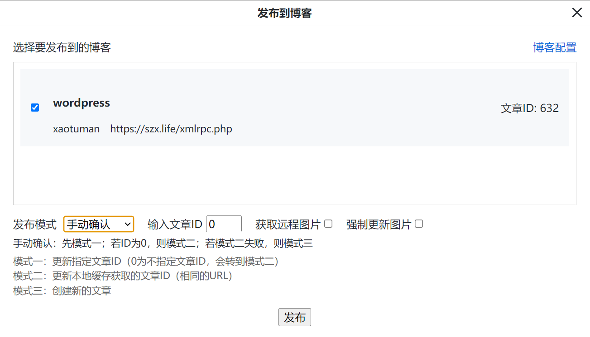
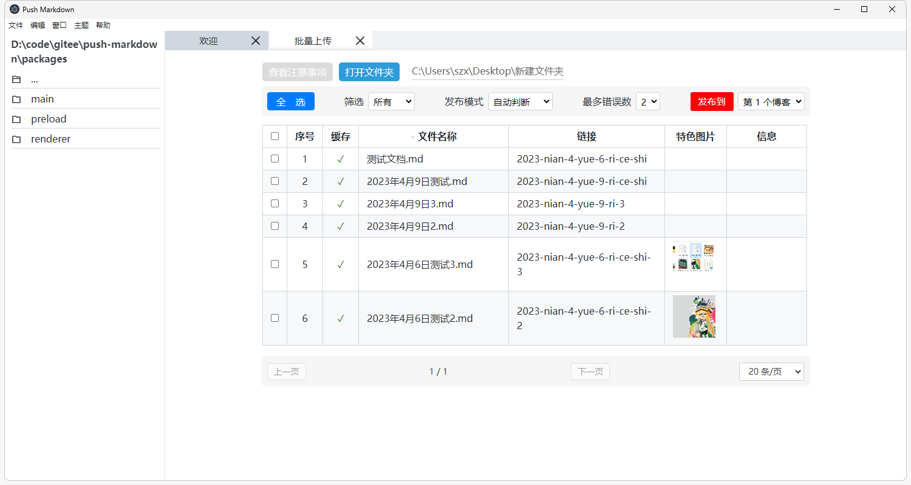

# 使用教程

## 下载安装

从[Gitee发行版](https://gitee.com/xaotuman/push-markdown/releases)或者[软件更新网站](http://download.szx.life)下载最新版本的软件，然后进行安装。

## 写在前面

本软件开箱即用，但是有些功能需要一些操作之后才能够完美使用，因此先写在前面！

### 更新同名图片（重要！）

**wordpress更新之后，需要重新修改文件！**

**wordpress更新之后，需要重新修改文件！**

**wordpress更新之后，需要重新修改文件！**

**因为更新wordpress会把这个文件还原回去！**

本软件假设wordpress的图片的名称是唯一的，也就是每次更新同名的图片，会替换掉原来的图片，而不是新增一张图片(1)。但wordpress不支持这个功能，需要运行[change.sh](./change.sh)脚本。下载此文件并放在wordpress根目录下，或者自己改一下里面的path路径，然后给予执行权限，运行一下就行。

或者手动修改，修改的文件路径在wp-includes/class-wp-xmlrpc-server.php。找到mw_newMediaObject函数，在里面加入这一段，意思就是如果数据里面有`overwrite`属性，则删除原来的图片，然后再创建新的。

可以参考[网址](https://gist.github.com/koke/5720862#file-xmlrpc-test-upload-php)，或者参考我拷贝的[本地文件](docs/class-wp-xmlrpc-server.php)，在版本6.0.1的基础上进行的修改（这个文件基本上不会更新）。

```php
if ( !empty($data['overwrite']) && ($data['overwrite'] == true) ) {
    // Get postmeta info on the object.
    $old_file = $wpdb->get_row("
		SELECT ID
    	FROM {$wpdb->posts}
		WHERE post_title = '{$name}'
		AND post_type = 'attachment'
		");
    // Delete previous file.
    wp_delete_attachment($old_file->ID);
}
```

**注意：v1.x和v2.x不一样，v1.x还多更改了base64图片，现在发现不需要了，千万别再执行1.x的脚本！**

### 导入文章配置（强烈建议）

如果是第一次使用本软件，强烈建议导入文章和图片的相关配置，这样子你使用起来会更加方便，因为软件采用的是本地缓存的机制，如果本地有缓存，那么下次就是更新文章而不是再创建一篇新的文章，否则需要使用指定文章ID的方式强制更新图片。弊端就是第一次使用的时候，本地缓存都为空，所有已经发布的文章如果你想要修改，都需要重新指定ID！因此第一次使用强烈建议导入博客已经的文章和图片，或者换新电脑的时候，再次重新导入博客文章，或者把软件的设置文件复制过来（当然如果你旧电脑炸了或者由于某种原因打不开，从博客导入是更好的选择）。

在wordpress安装[**WP Import Export Lite**](https://cn.wordpress.org/plugins/wp-import-export-lite/)插件，这个插件可以非常优雅的导出文章的相关信息，而且可以自定义为JSON格式（很多插件都是CSV格式，吐了。wordpress本身也有导出，但我从来没成功过，下载都是失败😅）

> **注**：注意，接下来的部分`2.1.x`部分和`2.0.x`部分不一样！以下是`2.1.x`的版本！！！
>
> 从`2.0.x`转到`2.1.x`需要**重新导入**，先打开软件-设置-打开设置文件，然后删除`post`和`media`两个属性，之后再从剪切板导入JSON文件格式！！！！
>
> 具体解释以下，之前里面的格式是酱紫的：
>
> ```json
> "https!szx!life!xmlrpc!php&&xaotuman": {
> 	"post": {
> 		"wordpress": "195",
> 	},
> 	"media": {
> 		"erciyuan7!webp": "https://szx.life/wp-content/uploads/2021/07/erciyuan7.webp",
> 	}
> }
> ```
>
> 现在是酱紫的，数据结构发生了变化，原来是字符串，现在是对象，因为特色头图需要记录image_id，所以只能变成对象格式post则新增头图id，为了后续更新方便
>
> ```json
> "https!szx!life!xmlrpc!php&&xaotuman": {
>     "post": {
>         "wordpress": {
>             "post_id": "195",
>             "thumbnail_id": "450"
>         },
>      },
>     "media": {
>         "erciyuan7!webp": {
>             "image_url": "https://szx.life/wp-content/uploads/2021/07/erciyuan7.webp",
>             "image_id": "450"
>         }
>     }
> }
> ```

在wordpress后台管理的侧边栏打开WP Imp Exp，再去侧边栏点击新的导出，选择导出类型为文章，在选择字段里面，需要有**六**个字段，分别是`ID`、`Slug`、`Images Filename`、`Image URL`、`Images ID`、`_thumbnail_id`（这个字段可能是WP Import Export Lite插件或者wpjam插件提供的），在高级选项里面选择导出文件类型为JSON。就这样子，很简单，然后你可以点击右上角的预览看看，看看是不是这几个字段，然后选择导出下载，非常的简单。



如果你拿不准配置，可以用我的配置文件，在设置-管理模块，选择文件导入，导入的模版配置文件放在本文档同级的目录：[wp_import_export_lite_push_markdown_template.txt](./wp_import_export_lite_push_markdown_template.txt)，再去侧边栏点击新的导出，选择导出类型为文章，在右边的加载设置-表单保存设置，选择刚才导入的push-markdown配置。这一顿操作可能还不如直接自己手动配置导出项。

导出完JSON格式的文件，你只需要打开，然后全选复制，再打开软件，打开设置界面，有个**剪切板粘贴**的按钮，点一下就行了，**但前提是需要先把博客信息填写完！！！**。如果你不小心弄错了，重置全部设置，再导入就行😁

此时软件拥有文章的url、文章ID、文章对应的头图ID、图片名称、图片网络链接和图片ID号（主要用于特色图片的设置），使用起来就非常的顺畅了。

### MathJax使用（可选）

如果你在设置里面选择Mathjax不渲染，那么wordpress需要装对应的**插件**，他会解析mathjax语法！并有对应的css文件！

如果你在设置里面选择MathJax渲染，那么上传的文章里面不是MathJax语法，而是已经渲染过的**svg图片**，只需要让svg图片居中一下就行了（也就是设置一下css文件，不需要装插件）！

配置WordPress的外观-自定义-额外CSS，加入下面这行代码。

```css
mjx-container[jax="SVG"][display="true"] {
    display: block;
    text-align: center;
    margin: 1em 0;
}
```




## 开始使用

### 欢迎界面

打开软件，就是欢迎界面，非常清新脱俗啊！

左边文件列表是当前浏览文件的文件目录，欢迎界面的是安装目录。可以在窗口-文件列表中进行开启/关闭，或者使用Ctrl+Shift+L快捷键进行开启/关闭。


软件的风格是github的markdown样式，一共有两款主题，分别是浅色和深色，可以自由切换，所有界面都适配！！！（拜托，这很酷诶）当然，也能够切换中英，英文是翻译的，可能狗屁不通，本来不想加英文的，但是奈何原来的作者做了这个功能，我就保留下来了。



### 示例文档

详细的语法规则可以示例文档。点击欢迎界面的示例文档进行查看，或者点击菜单栏-帮助-查看示例文档，或是查看本目录下的[示例文档](./sample.md)。（都是一样的）

文件开头使用YAML语法格式定义文章的信息，重点要注意的是**建议给文章配置url参数**，如果懒得配置，那么就为空，url会自动根据文件名或者title来转换成拼音url，简洁又美观！编辑已发布文章时根据这个参数来区分不同的文章。

文章分类的需要提前在wordpress创建好，如果没有创建好，那么则会被自动分类到未分类的类别里面。

```yaml
---
# 注释：文件开头使用YAML语法配置文章信息，之后是正常的Markdown语法
# Note: The beginning of the file uses YAML syntax to configure the blog meta data, followed by the normal Markdown syntax.

# 此处如果不配置标题，则提取Markdown中的一级标题，或使用文件名
# Title will be extracted from heading 1 of markdown or using file name if not configured here.
title: push-markdown 示例文档


# 此处如果不配置摘要，则从正文提取开头若干文字
# Abstract will be extracted from the begining of markdown content if not configured here.
abstract: 你好！这是一篇示例文档！


# URL用于固定链接、编辑文章功能，如果不配置，那么就会将标题转换为拼音，并且用"-"连接
# URL for fixed links, edit article function, if not configured, then the title will be converted to pinyin and connected with "-"
url: sample-docs-1


# 文章发布时间，使用的时区和系统设置一致，不设置则使用当前时间
# Article post time, time zone is the same as the system settings. Current time will be used if not configured here.
date: 2021-09-01 18:35:43


# 文章分类
category:
- Category1
- Category2


# 文章标签
tags:
- Tag1
- Tag222
- Tag333333
- Tag4444444444
- Tag5

#文章特色图片的本地地址，可以是相对地址也可以是绝对地址，上传的时候会同时设置文章特色图片，不写则不设置
thumbnail: sample_thumbnail.webp

#其他不在文章页面显示的图片，也想要一块上传，比如想要设置页面页眉封面，通过本软件并不能设置，但是可以先上传图片，再在wordpress中直接设置，减少一步手动上传的步骤
#other_images:
#- images/xxx.webp 
#- images/yyy.jpg

---

# 标题1 Heading 1

## 标题2 Heading 2

### 标题3 Heading 3

标题H1 Heading H1
====

标题H2 Heading H2
------


## 目录 Table
```

渲染的样式



### 设置

可以点击欢迎界面的设置进行站点的设置，或者点击菜单栏——文件——设置。

分为三部分，首先是博客站点设置，需要填写名称，URL，用户名和密码，填完自动保存。

目前仅支持WordPress。wordpress的url为 `https://你的域名/xmlrpc.php`

其次是发布设置，发布设置可以按照自己的需求来，不过就建议按照默认的来，也是最稳妥的。

最后是其他设置，比如打开设置文件更改，导入博客设置。

有些设置弄完之后，需要重新加载应用才能够生效。



### 发布

当填写完设置界面后，就可以发布。



发布一共有三种模式。

自动模式、手动模式和创建新文章。

1、创建新文章

这个最好理解了，创建一篇新的文章，即使在wordpress已经有了，也会创建一篇新的。此时图片会上传到Wordpress，并且在本地会有缓存。但不建议再次发布相同url的新文章，这会导致id被覆盖。

推荐只发布新文章（新url）的时候使用。

2、自动判断



自动判断会从本地获取之前已经发布过的文章（依据相同的url），如果获取不到的话，那么就会去获取远程的文章ID（这里是根据相同的标题），由于是获取所有的文章，并且包括内容，所以会比较费时费流量（文章多的情况，这种情况会出错，建议使用手动模式+指定文章ID这种模式），如果都没有获取到的话，那就会创建新的文章。

不检查远程图片默认勾选，仅检查本地缓存有没有远程图片的URL。如果为了比较保险的要求，可以不勾选，这样子检查完本地图片URL缓存之后，还会再去检查远程图片是否存在，双重保险。

这种模式推荐之前本机已经发布过新文章，并且覆盖旧文章的时候使用。

3、手动模式

手动模式在自动判断的基础上，又加了一层，可以输入指定的文章ID来强制覆盖旧文章。

因为有些图片本地已经有缓存网络链接了，所以并不会更新图片，如果文章更换了一张同名的图片，可以选择手动模式的强制更新图片，这样子强制把文章内的所有图片都更新一遍。

获取远程图片这个功能是在之前没有一键导入博客配置的时候弄得，主要目的就是本地没有这篇文章缓存的时候，通过手动输入文章ID的同时，把wordpress上文章已有的图片url扒拉下来，现在感觉用处不大，但就留着吧。



文章ID在wordpress后台的文章找到ID（这是用了WPJAM这个插件能直接看到，否则需要点击文章，在地址栏里面有postID）。


如果文章ID为0的话，那么就变成和自动判断一个逻辑，只不过需要多一步操作，会弹出是编辑此文章还是创建新文章，那么选择其中一个就行了（**只建议编辑此文章！！！**）。


图片的逻辑如下：

​	如果在手动模式下，选择了强制更新图片，那么就会强制覆盖原来有的图片，而且不会生成新的图片。自动覆盖的代码也需要修改wordpress的部分代码，因为wordpress的xmlrpc原本的逻辑是会生成-1,-2这样后缀的图片，而不会覆盖原来的图片，所以需要加一小段。

​	如果在手动模式下，选择了获取远程图片，那么就会把远程文章中的每一张图片的url赋给本地图片URL缓存，需要满足本地文章中的图片名称与网络文章的图片名称一致。这种应用场景是本地没有网络那篇文章，那么只需要输入ID并且勾选这个选项，本地图片URL缓存就会更新为远程图片URL，而不会再一次强制更新图片到远程的网络文章，这对于网络文章图片特别多的情况非常有用，节省很多时间。

​	强制更新图片和获取远程图片两个操作逻辑互斥，不能够同时选择，只能至多选择一个。

​	如果在手动模式下的不强制更新图片或者自动模式，那么就会检查本地缓有没有图片记录，如果勾选了“不检查远程图片”这个选项，那么就不会检查远程图片，如果勾选了那么还会再检查远程图片，如果都检查成功，那么就不会更新图片，即便图片已经经过了修改（只看文件名称）。如果没有，那么也会进行覆盖更新。

​	因此我的建议是，在远程删除了图片，或者本地修改了图片，那么就强制更新图片，自动模式不一定有效，因为有时候还有CDN的效果，即使删除了图片，CDN还有缓存，会有影响。

### 完成

如果设置完了wordpress和push-markdown，那么就可以上传文章了，最好拿帮助->查看示例文章的sample.md这篇文章上传，里面覆盖了绝大的部分文章用例，包括网络图片，本地图片，各种格式，还有公式。文章的发布日期是在2021年9月1日，所以别说找不到文章啦！

发布完成后，windows会有消息弹出，表示发布成功了，这时候你就可以去WordPress查看文章啦！


### 批量发布

批量发布界面，能够一次性发布多篇文件，在文件-批量发布打开就行了，点击打开文件夹，会展示选中文件夹下的所有markdown文件，勾选你要上传的文件，然后点击“发布到”，就能批量上传文件啦。使用前最好看看注意事项，此功能没有经过完整测试，容易炸。



### 小技巧

- 一些基本操作都有快捷键，比如发布，就是ctrl+p。这些在菜单栏里面都能够找到。
- 右键文件列表的文件或者标签栏里面的文件，可以通过默认程序打开markdown文件，比如typora。右键文件列表的文件夹可以打开资源管理器。
- 多设备的使用时候，可以用带有自动同步的云盘同步设置文件，在设置界面底部有设置的文件位置。
- 软件支持更新，在帮助-检查更新里面手动检查。

